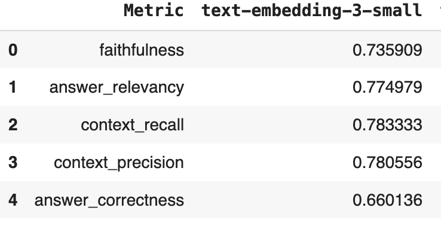
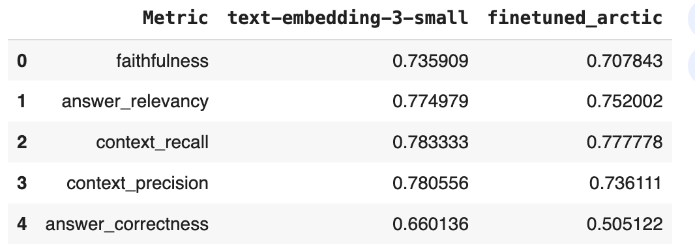

# Task 1: Dealing with the Data

### 1. Describe the default chunking strategy that you will use.  
I'm going to use **Recursive Chunking** (RecursiveCharacterTextSplitter) from LangChain.

### 2. Articulate a chunking strategy that you would also like to test out.  
I would also like to test out **Semantic Chunking** ([LangChain Documentation](https://python.langchain.com/docs/how_to/semantic-chunker/)).

### 3. Describe how and why you made these decisions.
I'm choosing **Recursive Chunking** as the default because, according to LangChain:

> "Recursive chunking divides the input text into smaller chunks in a hierarchical and iterative manner using a set of separators. If the initial attempt at splitting the text doesn’t produce chunks of the desired size or structure, the method recursively calls itself on the resulting chunks with a different separator or criterion until the desired chunk size or structure is achieved. This means that while the chunks aren’t going to be exactly the same size, they’ll still ‘aspire’ to be of a similar size."

This strategy is simple to implement and allows for consistent chunk sizes, which I believe will make our RAG pipeline perform more predictably compared to using irregular chunk sizes. I reviewed the two documents, and they appear to be standard with no unusual formatting, making this method suitable.

I would also like to test out **Semantic Chunking** because it focuses on dividing text based on semantic meaning rather than just character count or separators. This approach could lead to more meaningful chunks, which might improve the quality of document retrieval in the RAG pipeline, especially when dealing with documents with varied lengths and complex content.

# Task 2: Building a Quick End-to-End Prototype

### 1. Build a prototype and deploy to a Hugging Face Space, and create a short (< 2 min) loom video demonstrating some initial testing inputs and outputs.
<<<<<<< HEAD
Loom link: https://www.loom.com/share/2ee6825aed60424da6aadc414bbc800a?sid=1994ecda-c52e-4e71-afe9-166e862296e4
=======
Link: 
>>>>>>> e107018 (add report)

### 2. How did you choose your stack, and why did you select each tool the way you did?
I built a Retrieval-Augmented Generation (RAG) system with:

- **Recursive Chunking**: I used recursive splitting to maintain context across document chunks, ensuring important information isn't cut off while keeping manageable sizes for processing.

- **Text-Embedding-3-Small**: This model offers a good balance between performance and efficiency, generating compact embeddings for fast similarity searches without heavy computational costs.

- **Qdrant**: I chose Qdrant for its optimized vector similarity search, scalability, and seamless integration with the embedding model, making it ideal for fast, precise retrieval.

- **GPT-4o**: As the QA LLM, GPT-4o provides excellent generalization and context-based answers, making it perfect for handling complex queries in this RAG setup.

Each tool was selected to balance performance, scalability, and efficiency for the system’s needs and the quick turnaround of a prototype.

# Task 3: Creating a Golden Test Data Set

### 1. Assess your pipeline using the RAGAS framework including key metrics faithfulness, answer relevancy, context precision, and context recall.  Provide a table of your output results.

### 2. What conclusions can you draw about performance and effectiveness of your pipeline with this information?
The pipeline shows strong retrieval performance but needs improvement in generating accurate answers:

<<<<<<< HEAD
### What conclusions can you draw about performance and effectiveness of your pipeline with this information?

The pipeline demonstrates reasonably strong retrieval capabilities but reveals areas for improvement in the accuracy and relevance of generated answers:

- **Context Recall (0.783)** and **Context Precision (0.781)** indicate that the system is retrieving relevant information consistently, suggesting effective document chunking and vector search.
- **Faithfulness (0.736)** is decent but shows that roughly a quarter of the generated answers are not fully grounded in the retrieved information, which can be problematic in applications requiring high accuracy.
- **Answer Relevancy (0.775)** is solid, meaning the answers are usually related to the input queries, but there is room for improvement to make responses more directly relevant.
- **Answer Correctness (0.660)** is relatively low, suggesting that the system often produces answers that aren’t fully correct, likely due to limitations in how well the system understands or interprets the retrieved context.

### Summary:
- The pipeline is doing well at retrieving relevant context, but the generation of accurate and faithful answers needs refinement. This suggests a potential need for either a more advanced QA model or improvements in how retrieved chunks are passed to the answer generation process.
=======
### Strengths:
- **Context Recall (92.2%)** and **Precision (91.9%)** are high, meaning the system effectively retrieves relevant information.
- **Faithfulness (75.9%)** indicates that the generated answers are mostly grounded in retrieved data.

### Weaknesses:
- **Answer Correctness (52.6%)** and **Relevancy (67.6%)** need improvement, as the system struggles to generate consistently correct and relevant responses.

**Summary**: Retrieval is excellent, but the QA generation needs refinement for more accurate answers.
>>>>>>> e107018 (add report)

# Task 4: Fine-Tuning Open-Source Embeddings

### 1. Swap out your existing embedding model for the new fine-tuned version.  Provide a link to your fine-tuned embedding model on the Hugging Face Hub.
<<<<<<< HEAD
Fine-tuning model link: https://huggingface.co/ldldld/snowflake-arctic-embed-m-finetuned

### 2. How did you choose the embedding model for this application?
I selected `Snowflake/snowflake-arctic-embed-m` as the model for fine-tuning. To make this choice, I referred to the `mteb/leaderboard`, filtered for models with fewer than 250M parameters. Then I looked at all the top ranking models, filtered out models from personal accounts and models that require me to execute some suspicious executable. That ultimately left me with `Snowflake/snowflake-arctic-embed-m`, which is actually the one we used in class.
=======

### 2. How did you choose the embedding model for this application?
>>>>>>> e107018 (add report)

# Task 5: Assessing Performance

### 1. Test the fine-tuned embedding model using the RAGAS frameworks to quantify any improvements.  Provide results in a table.
<<<<<<< HEAD

It seems that off-the-shelve embedding model from OpenAI `text-embedding-3-small` is still better for our RAG, which honestly isn't too surprising. 
=======
>>>>>>> e107018 (add report)

### 2. Test the two chunking strategies using the RAGAS frameworks to quantify any improvements. Provide results in a table. 

### 3. The AI Solutions Engineer asks you “Which one is the best to test with internal stakeholders next week, and why?”
<<<<<<< HEAD
The original prototype is ideal for testing with internal stakeholders next week: it offers strong performance and is straightforward to implement. The only drawback is that it's not open-sourced. If this is a critical requirement, we can confirm with stakeholders and then explore the fine-tuning path. Based on initial results, we could likely fine-tune open-source models to achieve performance similar to that of OpenAI's `text-embedding-3-small`.
=======
>>>>>>> e107018 (add report)

# Task 6: Managing Your Boss and User Expectations

### 1. What is the story that you will give to the CEO to tell the whole company at the launch next month?
<<<<<<< HEAD
We're excited to introduce our **AI Industry Insights chatbot**, designed to provide real-time, nuanced guidance on the rapidly evolving impact of AI—especially in the context of politics and ethical enterprise applications. As we move through an election cycle and navigate the uncertainties around AI regulations, our chatbot empowers users to stay informed and make confident decisions. The tool leverages cutting-edge technology, offering insightful, up-to-date information on how AI is shaping industries and government policies. It’s a reliable companion for anyone looking to understand the future of AI in business and governance.

### 2. There appears to be important information not included in our build, for instance, the 270-day update on the 2023 executive order on Safe, Secure, and Trustworthy AI.  How might you incorporate relevant white-house briefing information into future versions? 
I'd add the new relevant white-house briefing information into the QDrant vectorstore. Then depending on if we use an open-sourced model or not, I'd proceed with re-finetuning the embedding model and evaluate with RAGAS.
=======

### 2. There appears to be important information not included in our build, for instance, the 270-day update on the 2023 executive order on Safe, Secure, and Trustworthy AI.  How might you incorporate relevant white-house briefing information into future versions? 
>>>>>>> e107018 (add report)
